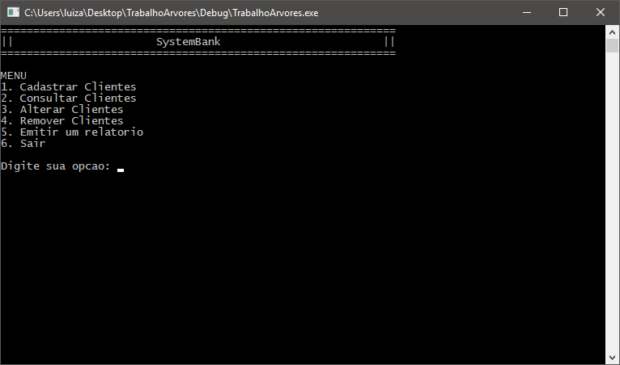

# Estrutura de Dados: Árvores Binárias

  Projeto desenvolvido em C++ com orientação a objetos na disciplina de Estrutura de Dados II, com o intuito de aprender a estrutura de árvores binárias. Foi inicialmente definida uma estrutura que contém um inteiro "Chave" representando o valor daquele nó da estrutura, um inteiro "Endereco" que representa o endereço daquele nó no arquivo binário que armazena os dados, um char "fbal" que se trata de um flag, representando o fator de balanceamento da árvore, isto é, se a árvore precisará sofrer ajustes em sua estrutura após a alteração de um ou mais de seus elementos; e, por fim, possui dois ponteiros apontando para o mesmo tipo de estrutura que está sendo explicada, um representando o lado esquerdo da ramificação, e o outro o lado direito. 
  A razão de se armazenar os endereços de um arquivo binário da árvore se dá pelo simples fato de que, ao encontrar um elemento na ávore, o que é muito mais rápido do que percorrer bytes em um arquivo binário, você pode acessar diretamente o endereço desejado naquele arquivo, o que traz como vantagem performance. 
  O projeto trata-se de uma aplicação básica onde se pode cadastrar clientes de um banco, bem como alterar, consultar e apagar registros, além da possibilidade de gerar relatórios em arquivos .txt.
  

Capturas de tela: 

